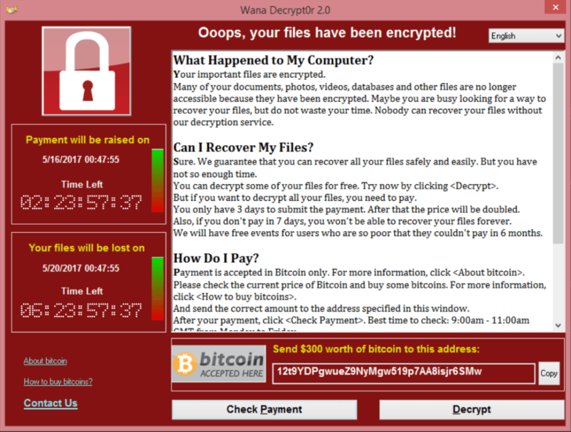
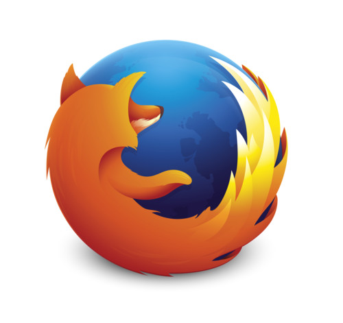
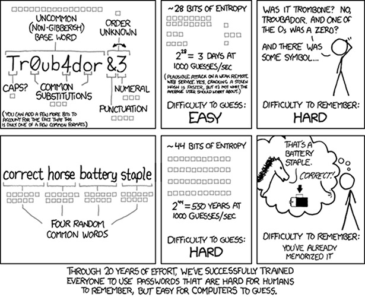

## Com sobreviure en l'era post-Snowden

Aprenent a navegar de forma segura

---

### Dario Castañé

i@dario.im / @im_dario

+++?image=assets/sobtec2016.png

---?image=assets/psycho-pass.png

---

### Rastre personal

- Adreça IP          |
- Navegador          |
- Sistema operatiu   |
- Gustos             |
  - Pàgines visitades: cookies i anuncis
  - Xarxes socials: què hi publiquem
  - Missatgeria: què hi diem (WhatsApp / Messenger)
- Edat, gènere, etc. |

---?image=assets/now-panic-and-freak-out-bg.png

---

### Defensa digital

- Sistema operatiu   |
- Navegador          |
- Missatgeria        |
- Correu electrònic  |
- Dispositius mòbils |
- Usuari             |

---

### Sistema operatiu

+++?image=assets/gnu-linux.png

+++

+++

### Important!

- Actualitza setmanalment
- Si estàs en Windows:
  - Antivirus
  - Actualitza el programari

---

### Navegador

- Mozilla Firefox

+++

#### Navegador: Extensions

- uBlock Origin
- Privacy Badger
- HTTPS Everywhere
- Decentraleyes
- Random Agent Spoofer

+++

#### Navegador: Cercador

- DuckDuckGo: !g
- Extensió: DuckDuckGo Plus

---

### Missatgeria

- Riot/Matrix: riot.im
- Signal
- Telegram \*

---

### Correu electrònic

+++

#### Proveïdors

- Fastmail
- Riseup
- Protonmail

+++

#### PGP/GPG

- GnuPG
- Mailvelope
- Keybase

---

### Dispositius mòbils

- Localització: Prey i desactivar Google
- Compra a Xina!
- Android
- Wifi
- F-Droid

---

### Usuari

+++

### Contrasenyes

- Keepass: emmagatzematge independent i segur

+++

### 2FA

- FreeOTP
- Google Authenticator

+++

### Enginyeria social

+++

### Camuflatge

- Tor
- VPN

---

### Regles d'or

- si és gratuït, tu ets el producte
- tria privacitat
- tria obert/lliure
- tria criptografia: E2E
- tria descentralització/federació

---

### Més informació:

- PRISM Break: prism-break.org
- Electronic Frontiers Foundation: eff.org
- Críptica: criptica.org
- La Quadatrure du Net: laquadrature.net
- European Digital Rights: edri.org

---

### Gràcies!

i@dario.im / @im_dario

---

### Bibliografia

- [Cooperatives, pirates i chavistes: el congrés dels ‘antiMobile’ - El País, 20 de febrer de 2016](http://cat.elpais.com/cat/2016/02/20/catalunya/1455987629_287544.html)
- [Taller de seguretat i privacitat: eines i comportaments per a protegir-te a tu i a qui t'envolta - Críptica, 2017](https://gitpitch.com/CripticaOrg/presentacio-eines-2017/master)
- [Smartphones: insegurs a tres bandes - Críptica, 2017](https://gitpitch.com/criptica/inseguretat-smartphone/master)
- [Password Strength - xkcd, 10 d'agost de 2011](https://xkcd.com/936/)
- [PRISM Break, 27 de maig de 2017](https://prism-break.org/)

