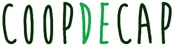

## Com sobreviure en l'era post-Snowden

Aprenent a navegar de forma segura

---

### Dario Castañé

i@dario.im / @im_dario

+++?image=assets/sobtec2016.png

---?image=assets/psycho-pass.png

---

### Rastre personal

- Adreça IP          |
- Navegador          |
- Sistema operatiu   |
- Gustos             |
  - Pàgines visitades: cookies i anuncis
  - Xarxes socials: què hi publiquem
  - Missatgeria: què hi diem (WhatsApp / Messenger)
- Edat, gènere, etc. |

---?image=assets/now-panic-and-freak-out-bg.png

---

[]

---

### Regles d'or

- si és gratuït, tu ets el producte
- prefereix privacitat
- prefereix obert/lliure
- prefereix criptografia: E2E
- prefereix descentralització/federació

---

### Gràcies!

i@dario.im / @im_dario

---

### Bibliografia

- [Cooperatives, pirates i chavistes: el congrés dels ‘antiMobile’ - El País, 20 de febrer de 2016](http://cat.elpais.com/cat/2016/02/20/catalunya/1455987629_287544.html)
- [Taller de seguretat i privacitat: eines i comportaments per a protegir-te a tu i a qui t'envolta - Críptica, 2017](https://gitpitch.com/CripticaOrg/presentacio-eines-2017/master)
